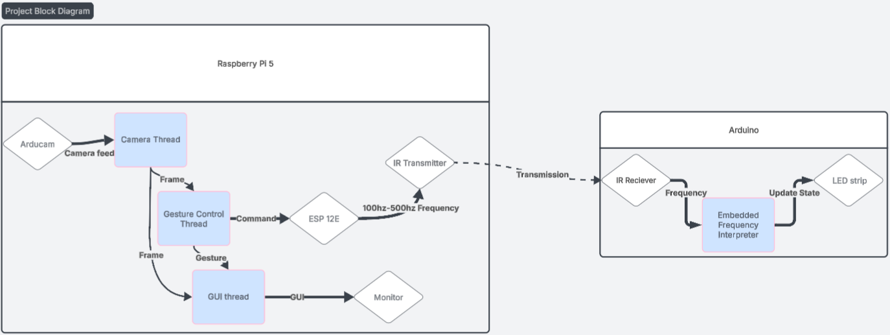
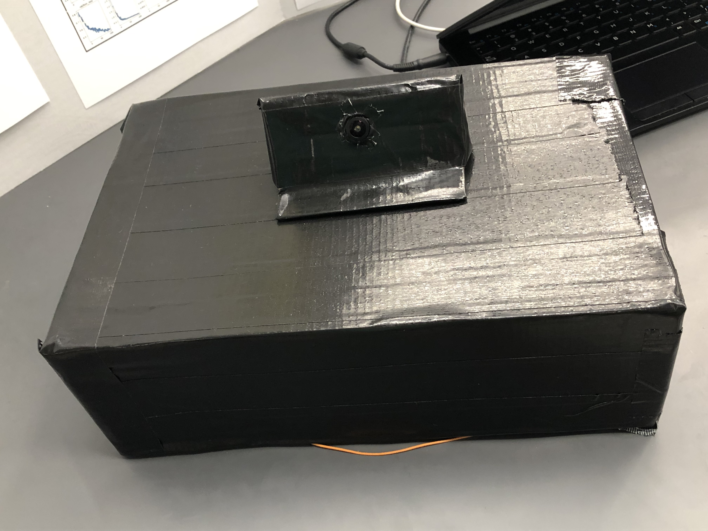
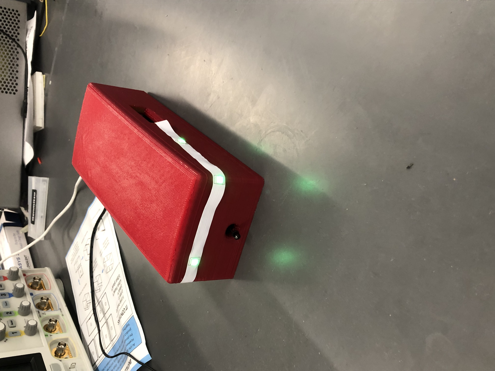
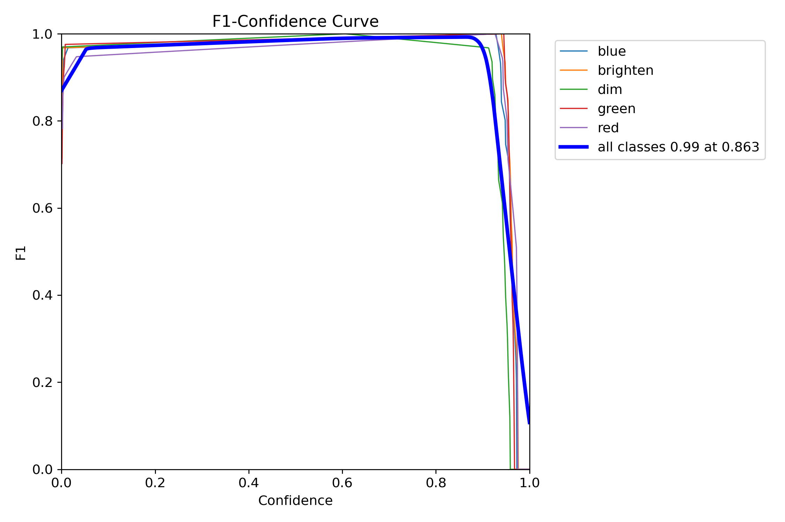
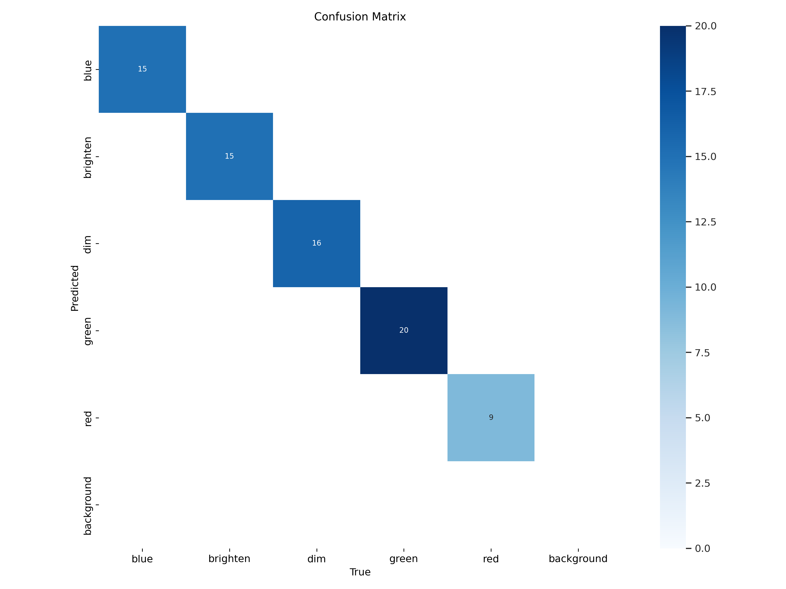
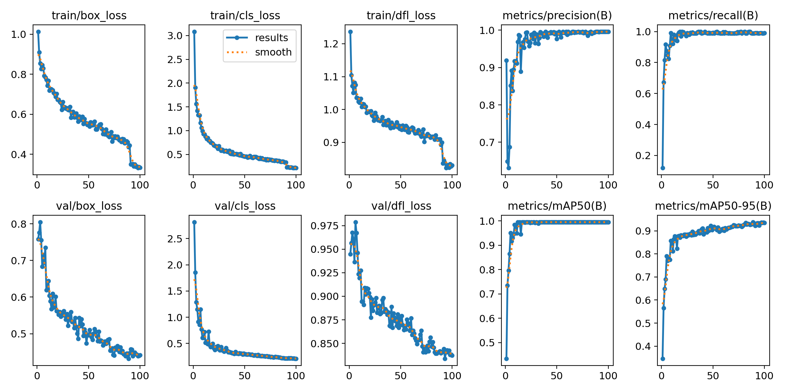
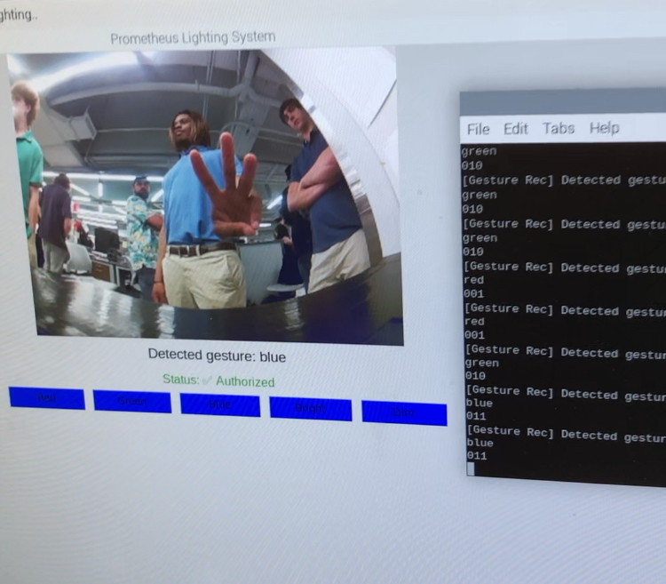

#   Prometheus Lighting System

A [TTU Whitacre College of Engineering](https://www.depts.ttu.edu/coe/) ECE-3338 lab project \
 

## Description

The Prometheus Lighting system is a light control system that leverages computer vision software to perform gesture detection. It relies on an infrared point to point communication system to transmit gestures detected by the main unit (Pi-5) to the control unit (Arduino Mega) of an LED strip.​

### Dependencies

* OpenCV
* ultralytics
  
### Overview

### Hardware

#### Master controller
* Raspberry pi 5
* Arducam
* NodeMCU ESP12E 
* Custom-built IR emitter \
   
  
#### Light control unit
* Custom-built IR receiver 
* Arduino mega
* LED lightstrip \
   

### Software

#### Model Training
* [Training pipeline](https://github.com/SamKa1u/YOLO-Transfer-Learning)
* Results:

  
 
 

#### GUI
  

## Meet The Team

Samuel Kalu (CV software development)
  
* Email : [samkalu@ttu.edu](mailto:samkalu@ttu.edu)
* [Linkedin](https://www.linkedin.com/in/samuel-kalu-74a359342/)

Aiden Zsebenyi (Software and Hardware development: IR reciever)
* Email : [azsebeny@ttu.edu](mailto:azsebeny@ttu.edu)

Michael Dec  (Hardware development: IR emitter)
* Email : [mdec@ttu.edu](mailto:mdec@ttu.edu)

## Acknowledgments

### Special thanks to Professor Everret Mcarthur
Inspiration, code snippets, etc.
* [TTU WCOE ECE Department](https://www.depts.ttu.edu/ece/)
* [Learnopencv](https://learnopencv.com/face-detection-opencv-dlib-and-deep-learning-c-python/#:~:text=We%20notice%20that%20the%20OpenCV,along%20with%20the%20bounding%20box.)
* [Label Studio](https://labelstud.io/guide/export)
* [Ultralytics](https://docs.ultralytics.com/guides/raspberry-pi/#set-up-ultralytics)
* [Edje Electronics](https://www.ejtech.io/learn/train-yolo-models)
* [Tkinter](https://docs.python.org/3/library/tkinter.html#module-tkinter)
* [Raspberry pi](https://www.raspberrypi.com/software/)
* [Bro Code](https://www.youtube.com/watch?v=STEOavXqXkQ&ab_channel=BroCode)
* [Gpiozero docs](https://gpiozero.readthedocs.io/en/latest/api_output.html)
  
